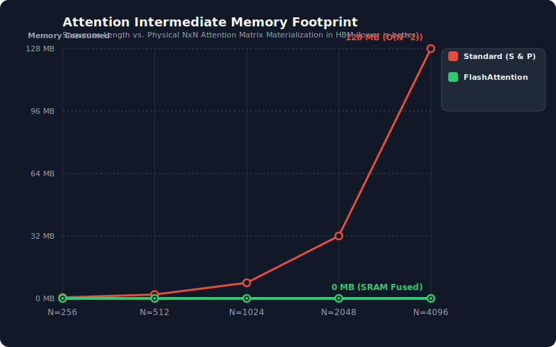

# ⚡ FlashAttention-CUDA: Making Attention Calculations Much Faster

This project shows how to make the "attention" part of AI models run incredibly fast. We start with a basic CPU program and make it faster step-by-step until we get a super fast GPU version called FlashAttention.

---

## 🚀 The Steps We Took to Make It Faster

The math formula for attention looks like this:
$$\text{Attention}(Q, K, V) = \text{Softmax}\left(\frac{QK^T}{\sqrt{d}}\right)V$$

We made four different versions to see how much we could speed things up:

### 1. Basic CPU Version (`attention_cpu`)
* **How it works**: A simple Python program that uses three loops inside each other to do the math.
* **The problem**: It runs on just one CPU core. It also has to create giant tables in the computer's memory, which makes it very slow.

### 2. Simple GPU Version (`naive_attention`)
* **How it works**: We use CUDA to run the math on a GPU. We give each thread on the GPU one small element of the output to calculate.
* **The problem**: It is faster than the CPU, but it creates a lot of memory "traffic." All the threads keep reading the same data from the GPU's main memory at the same time, which slows things down.

### 3. Tiled GPU Version (`tiled_attention`)
* **How it works**: Threads work together to load small blocks (tiles) of data into a super-fast memory right next to the GPU processor called shared memory (SRAM).
* **The trick**: It uses a smart math trick called "online softmax" to calculate the values in small steps. This means we do not have to create giant tables in the slow memory.

### 4. Fully Fused FlashAttention Version (`fused_attention`)
* **How it works**: This is our fastest version. It uses every trick in the book to squeeze out maximum speed:
    * **Local pockets (Registers)**: We put the data directly into the threads' local registers, which is the fastest storage possible.
    * **Warp Shuffling**: Threads talk directly to their neighbors to find maximum values instantly without waiting.
    * **Smart division**: We do division calculations outside of the main loop so the GPU does not have to repeat them.
    * **Zero memory waste**: We never save intermediate calculations to the slow main memory. Everything is kept inside fast registers.

---

## 📊 Test Results

We ran these tests on an NVIDIA GPU. We tested different sentence lengths ($N$) with a hidden dimension size ($d$) of 64.

| Sequence Length ($N$) | Version | Avg Speed (ms) | Speedup vs CPU | Math Speed (GFLOPs/s) | Memory Bandwidth (GB/s) | Extra Memory Used |
| :--- | :--- | :--- | :--- | :--- | :--- | :--- |
| **N = 256** | CPU Baseline | 9.268 ms | 1.0x | 1.81 GFLOPs/s | 0.03 GB/s | 0.5 MB |
| | Simple GPU | 4.879 ms | 1.9x | 3.44 GFLOPs/s | 0.05 GB/s | 0.5 MB |
| | Tiled GPU | 1.484 ms | 6.2x | 11.31 GFLOPs/s | 0.18 GB/s | 0.5 MB |
| | **Fused Flash** | **0.856 ms** | **10.8x** | **19.59 GFLOPs/s** | **0.31 GB/s** | **0.0 MB** |
| **N = 512** | CPU Baseline | 29.843 ms | 1.0x | 2.25 GFLOPs/s | 0.02 GB/s | 2.0 MB |
| | Simple GPU | 19.410 ms | 1.5x | 3.46 GFLOPs/s | 0.03 GB/s | 2.0 MB |
| | Tiled GPU | 2.980 ms | 10.0x | 22.52 GFLOPs/s | 0.18 GB/s | 2.0 MB |
| | **Fused Flash** | **1.718 ms** | **17.4x** | **39.07 GFLOPs/s** | **0.31 GB/s** | **0.0 MB** |
| **N = 1024** | CPU Baseline | 185.146 ms | 1.0x | 1.45 GFLOPs/s | 0.01 GB/s | 8.0 MB |
| | Simple GPU | 77.503 ms | 2.4x | 3.46 GFLOPs/s | 0.01 GB/s | 8.0 MB |
| | Tiled GPU | 5.810 ms | 31.9x | 46.21 GFLOPs/s | 0.18 GB/s | 8.0 MB |
| | **Fused Flash** | **3.332 ms** | **55.6x** | **80.57 GFLOPs/s** | **0.31 GB/s** | **0.0 MB** |
| **N = 2048** | CPU Baseline | 892.190 ms | 1.0x | 1.20 GFLOPs/s | 0.00 GB/s | 32.0 MB |
| | Simple GPU | 271.245 ms | 3.3x | 3.96 GFLOPs/s | 0.01 GB/s | 32.0 MB |
| | Tiled GPU | 11.712 ms | 76.2x | 91.68 GFLOPs/s | 0.18 GB/s | 32.0 MB |
| | **Fused Flash** | **6.632 ms** | **134.5x** | **161.90 GFLOPs/s** | **0.32 GB/s** | **0.0 MB** |
| **N = 4096** | CPU Baseline | 3598.747 ms | 1.0x | 1.19 GFLOPs/s | 0.00 GB/s | 128.0 MB |
| | Simple GPU | 1007.317 ms | 3.6x | 4.26 GFLOPs/s | 0.00 GB/s | 128.0 MB |
| | Tiled GPU | 27.711 ms | 129.9x | 154.99 GFLOPs/s | 0.15 GB/s | 128.0 MB |
| | **Fused Flash** | **14.142 ms** | **254.5x** | **303.71 GFLOPs/s** | **0.30 GB/s** | **0.0 MB** |

---

## 📈 Visualizing Our Results

### 1. Test Speed vs. Size
Shows how slow the CPU and normal GPU versions get as the size of our data grows. The Tiled and Fused GPU versions stay super flat and fast.


### 2. GPU Speedup vs. CPU Baseline
Shows how many times faster the GPU versions are than our CPU baseline. The Fused Flash version is **254.5 times faster** at size 4096!


### 3. Extra Memory Used
Shows how standard attention uses up massive amounts of memory (128 megabytes at size 4096), while FlashAttention uses **0 megabytes** of intermediate main memory.



---

## 🧠 Why is FlashAttention so much faster?

A lot of people think FlashAttention is faster because it does less math. **That is actually wrong.** It does the exact same amount of math (sometimes even a tiny bit more!).

The real secret is **how it reads and writes memory**:

1. **Slow Memory vs. Fast Memory**: The GPU's main memory (HBM) is big but slow. The memory right on the chip (SRAM and Registers) is tiny but lightning fast.
2. **The Grocery Store Analogy**: Imagine you are cooking a meal. Standard attention is like driving all the way to the grocery store to get one ingredient, driving home, and then driving back to the store for the next ingredient. You waste all your time driving!
3. **The Kitchen Fridge (FlashAttention)**: FlashAttention is like loading all the ingredients into your kitchen fridge (SRAM/Registers) once, doing all the cooking on the counter, and only walking out to the trash can at the very end. 

By keeping all the middle steps inside fast GPU registers instead of writing them back to slow main memory, we avoid the slow memory traffic entirely.

---

## 🛠️ How to Build and Run This Project

### What you need
* A computer running Linux
* An NVIDIA GPU with CUDA Toolkit installed
* CMake (version 3.18 or newer)
* Python 3 (to make the graphs)

### 1. Compile the code
Run these commands in your terminal to build the project in high-speed Release mode:
```bash
mkdir -p build && cd build
cmake -DCMAKE_BUILD_TYPE=Release ..
make -j
```

### 2. Run the tests
Execute the program to run all the speed tests and check if the results are correct:
```bash
./build/attention_engine
```

### 3. Make the graphs
Run this simple Python script to take the numbers from your tests and turn them into the beautiful SVG graphs:
```bash
python3 benchmarks/plot_benchmarks.py
```
Your new graphs will show up in the `benchmarks/result/plot/` folder!
