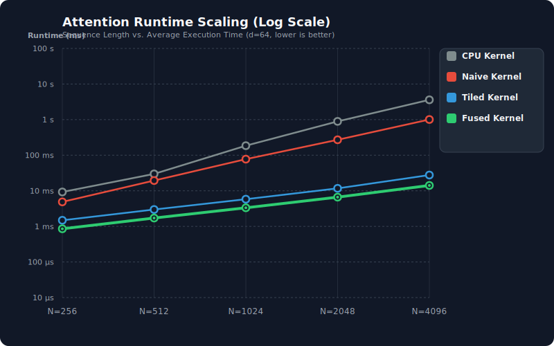
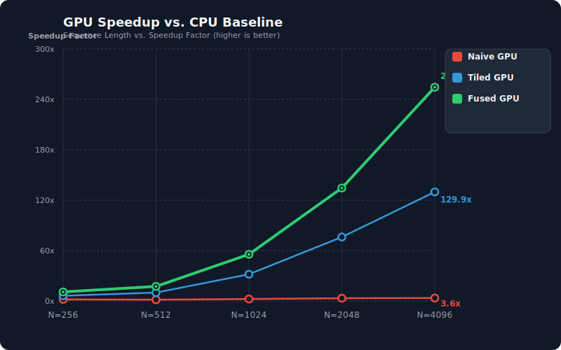

# ⚡ FlashAttention-CUDA: Systems-Level Attention Optimization

[](https://developer.nvidia.com/cuda-toolkit)
[](https://en.cppreference.com/)
[](LICENSE)
[](#benchmarking-results)

This repository contains a high-performance CUDA implementation of the **FlashAttention** algorithm, scaling through a 4-phase optimization pipeline from a naive CPU baseline up to a fully fused, register-cached, warp-shuffled, IO-aware GPU kernel.

---

## 🚀 Optimization Pipeline

The attention mechanism computes:
$$\text{Attention}(Q, K, V) = \text{Softmax}\left(\frac{QK^T}{\sqrt{d}}\right)V$$

We implement and evaluate four distinct phases of optimization:

### 1. CPU Baseline (`attention_cpu`)
*   **Approach**: Standard triple-nested loop computation.
*   **Complexity**: $O(N^2 d)$ floating-point operations, $O(N^2)$ memory footprint.
*   **Bottleneck**: Extremely slow single-threaded execution; physical materialization of intermediate $N \times N$ matrices ($S$ and $P$) in system DRAM.

### 2. Naive CUDA Kernel (`naive_attention`)
*   **Approach**: Parallelized grid launch mapping one thread to each output element $O[i, j]$.
*   **Complexity**: $O(N^2 d)$ arithmetic.
*   **Bottleneck**: **Severe HBM memory redundant traffic**. Each thread independently streams the entire $Q$ row, $K$ matrix, and $V$ column from GPU Global Memory (HBM) into registers, performing redundant loads at a factor of $O(N \cdot d)$.

### 3. Shared-Memory Tiled Kernel (`tiled_attention`)
*   **Approach**: Cooperative tile loading using GPU SRAM. 
*   **Mechanism**: Threads cooperatively load blocks of $Q$, $K$, and $V$ into shared memory (`Qs`, `Ks`, `Vs`) of size `TILE_SIZE x d`.
*   **Softmax**: Implements **online softmax** (from Milakov & Gimelshein, 2018) to compute softmax statistics ($m_i, l_i$) incrementally across blocks.
*   **Speedup**: Drastically reduces HBM traffic by reusing data within SRAM tiles.

### 4. Fully Fused FlashAttention-Style Kernel (`fused_attention`)
*   **Approach**: Hardware-aware register caching, coalesced global memory operations, and warp-level reduction shuffles.
*   **Key Optimizations**:
    *   **Register Caching**: Cooperatively loads $Q$ tile into SRAM, then caches it directly in thread **registers** (`Q_local`), completely avoiding SRAM bank conflicts during matrix multiplication.
    *   **Warp-Level Shuffles**: Employs fast registers-based shuffle intrinsics (`__shfl_xor_sync`) to perform warp reductions for row-max and row-sums, bypassing shared memory overhead.
    *   **In-Place Math Scaling**: Computes stable scaling factors outside loops, reducing division operations inside the hot loops.
    *   **Zero $N \times N$ Materialization**: Keeps attention scores and exponents in registers/SRAM, completely avoiding HBM write/read roundtrips for intermediate matrices.

---

## 📊 Benchmarking Results

The following benchmarks were gathered on an NVIDIA GPU using **Release** builds averaged over **15 iterations** (with warmups and active output resets between runs). 

*   **Embedding Dimension ($d$)**: 64
*   **Sequence Lengths ($N$)**: $\{256, 512, 1024, 2048, 4096\}$

### Performance Summary Table

| Sequence Length ($N$) | Implementation | Avg Runtime (ms) | Speedup vs CPU | Throughput (GFLOPs/s) | Effective Bandwidth (GB/s) | Intermediate HBM Memory |
| :--- | :--- | :--- | :--- | :--- | :--- | :--- |
| **N = 256** | CPU Baseline | 9.268 ms | 1.0x | 1.81 GFLOPs/s | 0.03 GB/s | 0.5 MB ($O(N^2)$) |
| | Naive CUDA | 4.879 ms | 1.9x | 3.44 GFLOPs/s | 0.05 GB/s | 0.5 MB ($O(N^2)$) |
| | Tiled CUDA | 1.484 ms | 6.2x | 11.31 GFLOPs/s | 0.18 GB/s | 0.5 MB ($O(N^2)$) |
| | **Fused Flash** | **0.856 ms** | **10.8x** | **19.59 GFLOPs/s** | **0.31 GB/s** | **0.0 MB** ($O(1)$) |
| **N = 512** | CPU Baseline | 29.843 ms | 1.0x | 2.25 GFLOPs/s | 0.02 GB/s | 2.0 MB ($O(N^2)$) |
| | Naive CUDA | 19.410 ms | 1.5x | 3.46 GFLOPs/s | 0.03 GB/s | 2.0 MB ($O(N^2)$) |
| | Tiled CUDA | 2.980 ms | 10.0x | 22.52 GFLOPs/s | 0.18 GB/s | 2.0 MB ($O(N^2)$) |
| | **Fused Flash** | **1.718 ms** | **17.4x** | **39.07 GFLOPs/s** | **0.31 GB/s** | **0.0 MB** ($O(1)$) |
| **N = 1024** | CPU Baseline | 185.146 ms | 1.0x | 1.45 GFLOPs/s | 0.01 GB/s | 8.0 MB ($O(N^2)$) |
| | Naive CUDA | 77.503 ms | 2.4x | 3.46 GFLOPs/s | 0.01 GB/s | 8.0 MB ($O(N^2)$) |
| | Tiled CUDA | 5.810 ms | 31.9x | 46.21 GFLOPs/s | 0.18 GB/s | 8.0 MB ($O(N^2)$) |
| | **Fused Flash** | **3.332 ms** | **55.6x** | **80.57 GFLOPs/s** | **0.31 GB/s** | **0.0 MB** ($O(1)$) |
| **N = 2048** | CPU Baseline | 892.190 ms | 1.0x | 1.20 GFLOPs/s | 0.00 GB/s | 32.0 MB ($O(N^2)$) |
| | Naive CUDA | 271.245 ms | 3.3x | 3.96 GFLOPs/s | 0.01 GB/s | 32.0 MB ($O(N^2)$) |
| | Tiled CUDA | 11.712 ms | 76.2x | 91.68 GFLOPs/s | 0.18 GB/s | 32.0 MB ($O(N^2)$) |
| | **Fused Flash** | **6.632 ms** | **134.5x** | **161.90 GFLOPs/s** | **0.32 GB/s** | **0.0 MB** ($O(1)$) |
| **N = 4096** | CPU Baseline | 3598.747 ms | 1.0x | 1.19 GFLOPs/s | 0.00 GB/s | 128.0 MB ($O(N^2)$) |
| | Naive CUDA | 1007.317 ms | 3.6x | 4.26 GFLOPs/s | 0.00 GB/s | 128.0 MB ($O(N^2)$) |
| | Tiled CUDA | 27.711 ms | 129.9x | 154.99 GFLOPs/s | 0.15 GB/s | 128.0 MB ($O(N^2)$) |
| | **Fused Flash** | **14.142 ms** | **254.5x** | **303.71 GFLOPs/s** | **0.30 GB/s** | **0.0 MB** ($O(1)$) |

---

## 📈 Scaling Visualizations

### 1. Execution Runtime vs. Sequence Length
Shows the exponential execution overhead of the CPU and Naive CUDA implementations compared to the flat, extremely efficient execution curves of the Tiled and Fused kernels.



### 2. Speedup Relative to CPU Baseline
Visualizes the progressive speedup gains through each optimization phase, showing Fused FlashAttention achieving up to **254.5x** speedup at $N = 4096$.



### 3. Physical HBM Memory Footprint Scaling
Highlights the quadratic $O(N^2)$ memory explosion of standard attention (which reaches **128 MB** for a single head at $N=4096$) versus FlashAttention's memory-IO aware approach which materializes **0 MB** of intermediate matrix data in HBM.


---

## 🧠 Fundamental Systems Insight

### Why is FlashAttention so much faster?

A common misconception is that FlashAttention is faster because it reduces floating-point operations (FLOPs). In fact, FlashAttention performs **the exact same number of FLOPs** (and technically slightly more, due to incremental scaling updates during online softmax). 

The true breakthrough is **IO-Awareness**:

1.  **Memory Hierarchies**: Modern GPUs are massively compute-dense but memory-bandwidth limited. High-Bandwidth Memory (HBM) is slow (relative to compute), while On-Chip Shared Memory (SRAM) and Registers are extremely fast.
2.  **The IO Bottleneck**: In standard attention, the intermediate matrix $S = QK^T$ and its softmax $P = \text{Softmax}(S)$ must be written out to HBM, and then read back from HBM to compute $O = PV$. 
3.  **Kernel Fusion**: By computing the attention block-by-block using **online softmax**, FlashAttention keeps all intermediate matrices inside SRAM and Registers. It **never materializes** the $N \times N$ matrix in HBM, eliminating high-latency memory roundtrips. 

By restructuring the algorithm to be IO-aware, FlashAttention shifts the attention mechanism from a **memory-bandwidth bound** bottleneck to a highly efficient **compute-bound** operation.

---

## 🛠️ Build and Run

### Prerequisites
*   Ubuntu / Linux OS
*   NVIDIA GPU with CUDA Toolkit installed
*   CMake 3.18+
*   Python 3.x (for generating SVGs)

### Compilation
Build the project using the highly optimized **Release** profile:
```bash
mkdir -p build && cd build
cmake -DCMAKE_BUILD_TYPE=Release ..
make -j
```

### Running Benchmarks
Execute the attention engine to run all iterations and correctness verifications:
```bash
./build/attention_engine
```

### Generating Visualizations
Run the custom pure-Python script to compile the benchmark CSV data into vector SVG plots:
```bash
python3 benchmarks/plot_benchmarks.py
```
This will automatically generate the SVGs inside `benchmarks/results/`.
