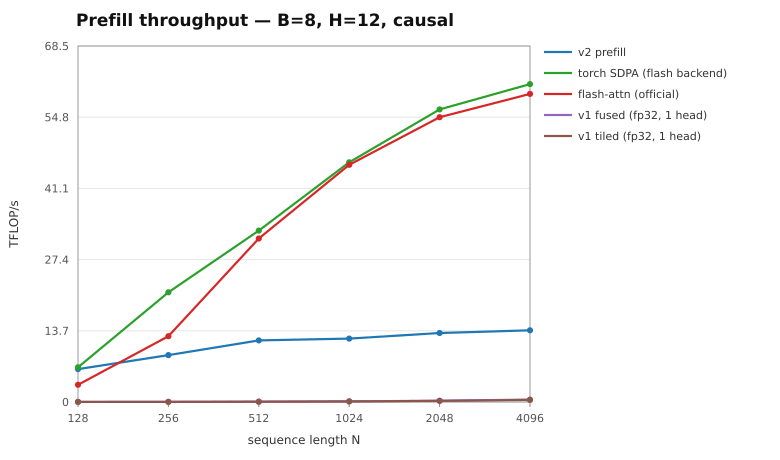

# flash-attention-cuda

[](https://github.com/shrvan30/flash-attention-cuda/actions/workflows/ci.yml)

Batched multi-head causal FlashAttention for `head_dim = 64`, written from scratch in CUDA and
packaged as a PyTorch extension. fp16 in and out, fp32 accumulation, separate kernels for
prefill and for decoding against a KV cache.

```python
import flashattn_cuda

o = flashattn_cuda.prefill(q, k, v, causal=True, scale=1/8)   # (B, H, N, 64) fp16
o = flashattn_cuda.decode(q, k_cache, v_cache, seq_lens, scale=1/8)
```

## Numbers

RTX 3090 (sm_86, 82 SMs), driver 595.71.05, CUDA 13.2, PyTorch 2.13.0+cu130,
flash-attn 2.8.3.post1. Prefill, **B=8, H=12, causal**, median of three runs of 30 launches:

| N | v2 prefill | torch SDPA (flash) | flash-attn 2.8.3 | v1 fused (scaled to B·H) |
| ---: | ---: | ---: | ---: | ---: |
| 1024 | 1.04 ms · 12.36 TFLOP/s | 0.28 ms · 45.96 | 0.28 ms · 45.98 | 217.8 ms · 0.12 |
| 2048 | 3.88 ms · 13.28 TFLOP/s | 0.92 ms · 55.80 | 0.95 ms · 54.21 | 424.0 ms · 0.24 |
| 4096 | 14.97 ms · 13.77 TFLOP/s | 3.37 ms · 61.20 | 3.49 ms · 59.15 | 888.2 ms · 0.46 |

Decode, single sequence, H=12, one token per call, against a **per-step eager SDPA loop**
(one `scaled_dot_product_attention` call per token over the whole cache):

| context | v2 decode | per-step eager SDPA loop |
| ---: | ---: | ---: |
| 128 | 0.0122 ms · 82,064 tok/s | 0.0143 ms · 69,754 tok/s |
| 512 | 0.0122 ms · 81,642 tok/s | 0.0188 ms · 53,170 tok/s |
| 1024 | 0.0127 ms · 78,755 tok/s | 0.0189 ms · 52,978 tok/s |
| 2048 | 0.0210 ms · 47,637 tok/s | 0.0213 ms · 47,011 tok/s |

That baseline is a correct reference, not a tuned decode kernel: it does not split the KV
dimension, so it leaves unused exactly the parallelism this kernel exploits. The serious
baselines are flash-attn's dedicated decode path (`flash_attn_with_kvcache`) and FlashDecoding,
which do split KV and run on tensor cores. Measuring against those is deferred, so read the
decode numbers as "faster than the obvious PyTorch way to decode" and not as a claim about
state-of-the-art decode kernels.



### The honest gap

**v2 prefill is about 4.4x slower than flash-attn**, and 59x faster than the v1 kernels it
replaces at N=4096 (208x at N=1024, where v1's lack of batching hurts most). Two shapes go the
other way: at N=128 v2 is 2–4x *faster* than either library
(0.017 ms vs 0.036 / 0.061 ms at B=1), because at that size both are dominated by fixed launch
overhead that a simpler kernel does not pay. `torch.sdpa`'s flash backend and the `flash-attn`
package track each other closely, as expected — SDPA dispatches to the same FlashAttention-2
kernels.

The gap is not a tuning gap, and the analysis says where it comes from. v2 sustains 13.8–14.2
TFLOP/s, which is **38% of this card's 36.8 TFLOP/s fp32 FMA peak** — a respectable fraction of
the machine this kernel is using. The problem is which machine it uses: every multiply happens
on the CUDA cores, and the operands arrive through shared memory at roughly 1.75 bytes per FMA,
while an SM sustains 1.0 byte per FMA. That caps this design near 57% of fp32 peak before any
other overhead. flash-attn is not winning by being 4x better at the same game — it runs the
matmuls on the tensor cores, whose fp16 peak is about 2x the fp32 pipe and which take their
operands from registers via `ldmatrix`/`mma` instead of the shared-memory path that limits us.

Confirming *which* unit is saturated needs hardware performance counters, which the development
box does not expose; that measurement is deferred to a counter-capable card
([bench/profile_ncu.sh](bench/profile_ncu.sh)). Everything claimed above comes from CUDA-event
timings and the occupancy API — see [docs/profiles/analysis.md](docs/profiles/analysis.md).

So closing the gap means writing a WMMA/MMA kernel, not shaving instructions off this one. That
is deliberately out of scope for v2.0.0 and is the next planned step.

**Decode picks its split size per launch.** A decode call has only `batch x heads x splits`
blocks, so the split-K chunk decides whether the GPU is filled at all: with the chunk fixed at
512 keys, one sequence at context 1024 launched 24 blocks on an 82-SM card and reached 8.9% of
peak bandwidth, with an access pattern that was already one fully coalesced 128-byte request per
cached row. `decode` now chooses the largest power-of-two chunk in [128, 1024] for which
`batch · heads · ceil(S/chunk)` reaches two blocks per SM, falling back to the finest split when
no chunk can — largest-that-fits rather than finest-available, so the merge pass stays cheap.
At B=1, H=12 that is worth **2.2–3.2x**:

| S | fixed Sk=512 | adaptive | speedup |
| ---: | ---: | ---: | ---: |
| 512 | 0.0420 ms · 37.6 GB/s | 0.0130 ms · 123.2 GB/s | 3.24x |
| 1024 | 0.0421 ms · 75.0 GB/s | 0.0135 ms · 237.1 GB/s | 3.12x |
| 2048 | 0.0436 ms · 144.9 GB/s | 0.0194 ms · 330.3 GB/s | 2.25x |

The chunk size is a scheduling choice, not a numerical one — the log-sum-exp merge makes the
result independent of it, and the suite asserts that across every chunk in the range. Full
analysis in [docs/profiles/analysis.md](docs/profiles/analysis.md).

## What is in v2

| | |
| :-- | :-- |
| shapes | `(B, H, N, 64)`, contiguous row-major, fp16 |
| accumulation | fp32 throughout (scores, softmax statistics, output) |
| prefill | one block per `(batch, head, query tile)`, Br=64 x Bc=32, online softmax |
| causal | key tiles above the diagonal are skipped, not masked |
| decode | split-K over the cached keys, log-sum-exp merge of the partials |
| ragged batches | `seq_lens` is per-sequence; chunks past a sequence's end drop out |
| verification | 86 tests against an fp32 SDPA reference, tolerance 2e-3 |

`head_dim = 64` is a static assertion, not a runtime check: the tile shapes, register blocking
and vectorised loads are all resolved at compile time from it.

## Install

Requires an NVIDIA GPU of compute capability 8.0 or newer, a CUDA toolkit, and a working
PyTorch install.

```bash
git clone https://github.com/shrvan30/flash-attention-cuda.git
cd flash-attention-cuda
pip install -e .
```

The build targets `sm_86` (RTX 3090) by default; set `TORCH_CUDA_ARCH_LIST` for another card:

```bash
TORCH_CUDA_ARCH_LIST="8.0" pip install -e .
```

The extension links against the PyTorch already installed in the environment — an in-tree PEP
517 backend makes that work under pip's default build isolation, so no extra flags are needed.

## Test

```bash
pip install pytest
python -m pytest -m gpu           # 86 GPU tests
```

The suite compares against `scaled_dot_product_attention` computed in fp32 on upcast inputs, so
the measured difference is the kernel's error and not the reference's. It sweeps
B in {1,4} x H in {8,12,14} x N in {128,512,1024,2048,4096} x causal, plus sequence lengths that
are not tile multiples, decode against the causal prefill output, ragged decode batches, and
cache lengths straddling the split boundary.

## Benchmark and profile

```bash
python bench/run_bench.py       # timings and charts   -> docs/benchmarks.md
python bench/run_analysis.py    # occupancy + roofline -> docs/profiles/analysis.md
nsys profile -t cuda -o docs/profiles/prefill python bench/profile_workload.py prefill
bash bench/profile_ncu.sh       # counter capture      -> docs/profiles/summary.md
```

Full tables, chart sources and the machine description are in
[docs/benchmarks.md](docs/benchmarks.md); occupancy, the analytical roofline and the
timeline notes are in [docs/profiles/analysis.md](docs/profiles/analysis.md).
`bench/profile_ncu.sh` needs a card whose driver allows performance counters, and refuses
to run with instructions where it does not.

## Layout

```
csrc/            v2 extension: bindings.cpp, prefill.cu, decode.cu, legacy/
src/legacy/      v1 kernels, unchanged, still built by CMake and callable from Python
tests/           GPU correctness suite
bench/           benchmark and profiling drivers
docs/            generated benchmark tables, charts and profiles
```

## v1 — the earlier progression

v1 (tagged `v1.0.0`) was a teaching sequence — CPU baseline, naive GPU, tiled, fused — and its
numbers are kept in [docs/v1.md](docs/v1.md). It is single-head, fp32, non-causal, has no decode
path and no Python binding, so it cannot serve a transformer layer; the kernels are still built
and are benchmarked alongside v2 above for scale. v2 addresses every one of those limitations
except tensor cores.

## Licence

MIT — see [LICENSE](LICENSE).
