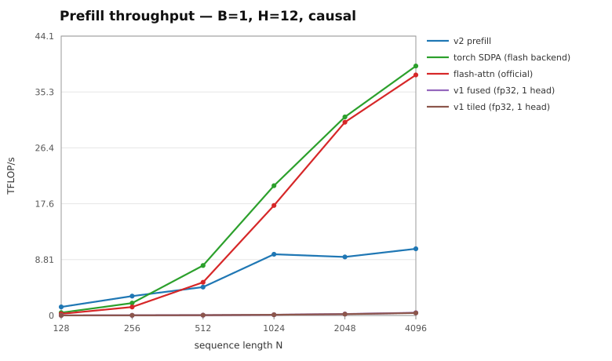
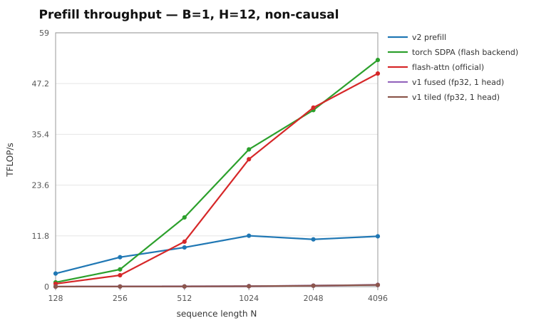
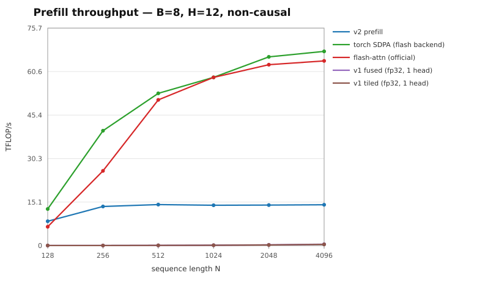
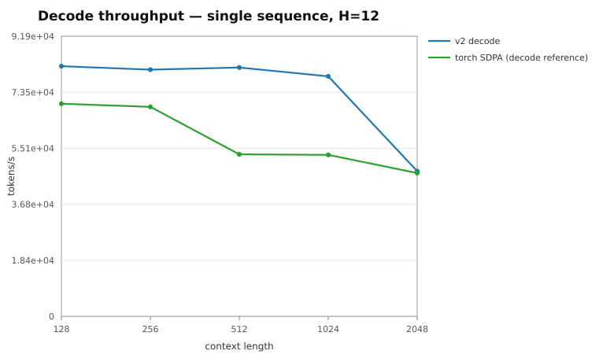

# FlashAttention v2 benchmarks

Every number below was measured by `bench/run_bench.py` on the machine described
here. Times are the median of three runs, each the mean of 30 launches after 10
warm-up launches. TFLOP/s counts `4 * B * H * N^2 * d` and halves it for causal.

| | |
| :-- | :-- |
| GPU | NVIDIA GeForce RTX 3090 (sm_86, 24 GB, 82 SMs) |
| Driver | 595.71.05 |
| CUDA toolkit (nvcc) | 13.2 |
| CUDA runtime (torch) | 13.0 |
| PyTorch | 2.13.0+cu130 |
| Python | 3.12.13 |
| flash-attn | 2.8.3.post1 |

## Prefill — B=1, H=12, causal

The v1 kernels are single-head, fp32 and have no causal path, so they cannot run this shape directly. Their column is one `(N, 64)` launch timed and multiplied by B*H = 12, which is what covering the same total work would cost; the causal tables reuse the same (non-causal) v1 measurement, so v1 is if anything flattered there.

| N | v2 prefill ms | torch SDPA (flash backend) ms | flash-attn (official) ms | v1 fused (fp32, 1 head) ms | v1 tiled (fp32, 1 head) ms |
| ---: | ---: | ---: | ---: | ---: | ---: |
| 128 | 0.017 | 0.036 | 0.061 | 3.836 | 4.297 |
| 256 | 0.031 | 0.032 | 0.061 | 7.307 | 8.317 |
| 512 | 0.087 | 0.031 | 0.063 | 14.400 | 16.434 |
| 1024 | 0.182 | 0.082 | 0.084 | 25.344 | 29.159 |
| 2048 | 0.596 | 0.166 | 0.169 | 51.886 | 59.260 |
| 4096 | 2.073 | 0.549 | 0.546 | 109.845 | 126.461 |

| N | v2 prefill TFLOP/s | torch SDPA (flash backend) TFLOP/s | flash-attn (official) TFLOP/s | v1 fused (fp32, 1 head) TFLOP/s | v1 tiled (fp32, 1 head) TFLOP/s |
| ---: | ---: | ---: | ---: | ---: | ---: |
| 128 | 1.46 | 0.70 | 0.41 | 0.01 | 0.01 |
| 256 | 3.22 | 3.15 | 1.64 | 0.03 | 0.02 |
| 512 | 4.63 | 12.84 | 6.36 | 0.06 | 0.05 |
| 1024 | 8.86 | 19.53 | 19.24 | 0.13 | 0.11 |
| 2048 | 10.82 | 38.80 | 38.15 | 0.25 | 0.22 |
| 4096 | 12.43 | 46.98 | 47.24 | 0.47 | 0.41 |

## Prefill — B=1, H=12, non-causal

The v1 kernels are single-head, fp32 and have no causal path, so they cannot run this shape directly. Their column is one `(N, 64)` launch timed and multiplied by B*H = 12, which is what covering the same total work would cost; the causal tables reuse the same (non-causal) v1 measurement, so v1 is if anything flattered there.

| N | v2 prefill ms | torch SDPA (flash backend) ms | flash-attn (official) ms | v1 fused (fp32, 1 head) ms | v1 tiled (fp32, 1 head) ms |
| ---: | ---: | ---: | ---: | ---: | ---: |
| 128 | 0.015 | 0.031 | 0.061 | 3.443 | 3.854 |
| 256 | 0.028 | 0.031 | 0.062 | 6.558 | 7.477 |
| 512 | 0.087 | 0.031 | 0.062 | 12.947 | 14.776 |
| 1024 | 0.273 | 0.082 | 0.090 | 26.080 | 29.307 |
| 2048 | 0.982 | 0.268 | 0.263 | 52.268 | 59.599 |
| 4096 | 3.780 | 0.826 | 0.839 | 110.317 | 126.585 |

| N | v2 prefill TFLOP/s | torch SDPA (flash backend) TFLOP/s | flash-attn (official) TFLOP/s | v1 fused (fp32, 1 head) TFLOP/s | v1 tiled (fp32, 1 head) TFLOP/s |
| ---: | ---: | ---: | ---: | ---: | ---: |
| 128 | 3.25 | 1.64 | 0.83 | 0.01 | 0.01 |
| 256 | 7.18 | 6.54 | 3.26 | 0.03 | 0.03 |
| 512 | 9.30 | 26.07 | 13.03 | 0.06 | 0.05 |
| 1024 | 11.78 | 39.05 | 35.84 | 0.12 | 0.11 |
| 2048 | 13.13 | 48.08 | 49.08 | 0.25 | 0.22 |
| 4096 | 13.64 | 62.39 | 61.40 | 0.47 | 0.41 |

## Prefill — B=8, H=12, causal

The v1 kernels are single-head, fp32 and have no causal path, so they cannot run this shape directly. Their column is one `(N, 64)` launch timed and multiplied by B*H = 96, which is what covering the same total work would cost; the causal tables reuse the same (non-causal) v1 measurement, so v1 is if anything flattered there.

| N | v2 prefill ms | torch SDPA (flash backend) ms | flash-attn (official) ms | v1 fused (fp32, 1 head) ms | v1 tiled (fp32, 1 head) ms |
| ---: | ---: | ---: | ---: | ---: | ---: |
| 128 | 0.032 | 0.030 | 0.062 | 27.574 | 31.153 |
| 256 | 0.089 | 0.038 | 0.062 | 54.500 | 61.784 |
| 512 | 0.272 | 0.099 | 0.105 | 112.470 | 119.657 |
| 1024 | 1.043 | 0.280 | 0.280 | 217.832 | 237.357 |
| 2048 | 3.882 | 0.924 | 0.951 | 424.015 | 469.932 |
| 4096 | 14.974 | 3.369 | 3.485 | 888.157 | 1020.464 |

| N | v2 prefill TFLOP/s | torch SDPA (flash backend) TFLOP/s | flash-attn (official) TFLOP/s | v1 fused (fp32, 1 head) TFLOP/s | v1 tiled (fp32, 1 head) TFLOP/s |
| ---: | ---: | ---: | ---: | ---: | ---: |
| 128 | 6.32 | 6.65 | 3.27 | 0.01 | 0.01 |
| 256 | 9.08 | 21.33 | 13.06 | 0.03 | 0.03 |
| 512 | 11.85 | 32.51 | 30.70 | 0.06 | 0.05 |
| 1024 | 12.36 | 45.96 | 45.98 | 0.12 | 0.11 |
| 2048 | 13.28 | 55.80 | 54.21 | 0.24 | 0.22 |
| 4096 | 13.77 | 61.20 | 59.15 | 0.46 | 0.40 |

## Prefill — B=8, H=12, non-causal

The v1 kernels are single-head, fp32 and have no causal path, so they cannot run this shape directly. Their column is one `(N, 64)` launch timed and multiplied by B*H = 96, which is what covering the same total work would cost; the causal tables reuse the same (non-causal) v1 measurement, so v1 is if anything flattered there.

| N | v2 prefill ms | torch SDPA (flash backend) ms | flash-attn (official) ms | v1 fused (fp32, 1 head) ms | v1 tiled (fp32, 1 head) ms |
| ---: | ---: | ---: | ---: | ---: | ---: |
| 128 | 0.048 | 0.031 | 0.062 | 27.752 | 31.329 |
| 256 | 0.119 | 0.040 | 0.062 | 55.494 | 61.804 |
| 512 | 0.439 | 0.123 | 0.133 | 117.483 | 121.976 |
| 1024 | 1.853 | 0.434 | 0.437 | 218.776 | 239.084 |
| 2048 | 7.308 | 1.582 | 1.640 | 414.292 | 469.893 |
| 4096 | 29.009 | 6.181 | 6.520 | 883.005 | 1020.630 |

| N | v2 prefill TFLOP/s | torch SDPA (flash backend) TFLOP/s | flash-attn (official) TFLOP/s | v1 fused (fp32, 1 head) TFLOP/s | v1 tiled (fp32, 1 head) TFLOP/s |
| ---: | ---: | ---: | ---: | ---: | ---: |
| 128 | 8.43 | 12.99 | 6.52 | 0.01 | 0.01 |
| 256 | 13.56 | 39.99 | 26.08 | 0.03 | 0.03 |
| 512 | 14.66 | 52.21 | 48.42 | 0.05 | 0.05 |
| 1024 | 13.91 | 59.36 | 58.93 | 0.12 | 0.11 |
| 2048 | 14.10 | 65.15 | 62.84 | 0.25 | 0.22 |
| 4096 | 14.21 | 66.71 | 63.24 | 0.47 | 0.40 |

## Decode — single sequence, H=12

Tokens/s is one decoded token per sequence per call, i.e. `batch / latency`.

| context | v2 decode ms | v2 decode tok/s | torch SDPA (decode reference) ms | torch SDPA (decode reference) tok/s |
| ---: | ---: | ---: | ---: | ---: |
| 128 | 0.0123 | 81,614 | 0.0146 | 68,611 |
| 256 | 0.0204 | 49,073 | 0.0149 | 67,027 |
| 512 | 0.0368 | 27,152 | 0.0199 | 50,169 |
| 1024 | 0.0369 | 27,127 | 0.0191 | 52,409 |
| 2048 | 0.0616 | 16,240 | 0.0213 | 46,950 |

## Charts

### Prefill B=1, causal

### Prefill B=1, non-causal

### Prefill B=8, causal

### Prefill B=8, non-causal

### Decode tokens/s

