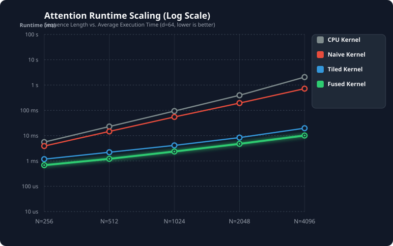
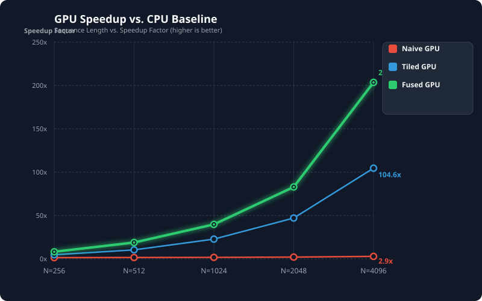
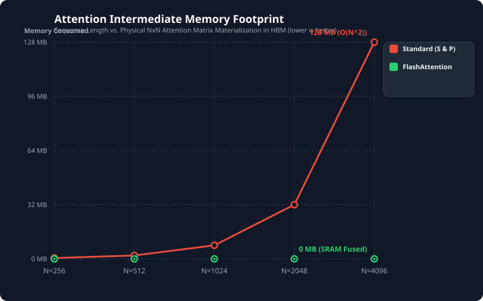

# v1 — the CPU-to-FlashAttention progression

This is the original v1 documentation, kept for reference. v1 is tagged `v1.0.0`; its kernels
live unchanged under `src/legacy/` and are still built by the CMake target. For the current
kernels see the [README](../README.md) and [benchmarks](benchmarks.md).

## 🚀 The Steps I Took to Make It Faster

The math formula for attention looks like this:
$$\text{Attention}(Q, K, V) = \text{Softmax}\left(\frac{QK^T}{\sqrt{d}}\right)V$$

I made four different versions to see how much I could speed things up:

### 1. Basic CPU Version (`attention_cpu`)
* **How it works**: A simple Python program that uses three loops inside each other to do the math.
* **The problem**: It runs on just one CPU core. It also has to create giant tables in the computer's memory, which makes it very slow.

### 2. Simple GPU Version (`naive_attention`)
* **How it works**: I use CUDA to run the math on a GPU. I give each thread on the GPU one small element of the output to calculate.
* **The problem**: It is faster than the CPU, but it creates a lot of memory "traffic." All the threads keep reading the same data from the GPU's main memory at the same time, which slows things down.

### 3. Tiled GPU Version (`tiled_attention`)
* **How it works**: Threads work together to load small blocks (tiles) of data into a super-fast memory right next to the GPU processor called shared memory (SRAM).
* **The trick**: It uses a smart math trick called "online softmax" to calculate the values in small steps. This means I do not have to create giant tables in the slow memory.

### 4. Fully Fused FlashAttention Version (`fused_attention`)
* **How it works**: This is our fastest version. It uses every trick in the book to squeeze out maximum speed:
    * **Local pockets (Registers)**: I put the data directly into the threads' local registers, which is the fastest storage possible.
    * **Warp Shuffling**: Threads talk directly to their neighbors to find maximum values instantly without waiting.
    * **Smart division**: We do division calculations outside of the main loop so the GPU does not have to repeat them.
    * **Zero memory waste**: We never save intermediate calculations to the slow main memory. Everything is kept inside fast registers.

---

## 📊 Test Results

> **These are historical v1.0.0-era numbers, and they are the one set in this repository not
> measured on the current benchmark machine.** They were taken on a different RTX 3090 host
> (CUDA 13.2, driver 595.71.05) at the time v1 was tagged, and are kept as the record of that
> release rather than re-measured. Do not compare them directly against anything in
> [benchmarks.md](benchmarks.md) or the [README](../README.md): those come from a single
> current machine (driver 580.126.09, CUDA 13.0, PyTorch 2.11.0+cu130) and the two hosts differ
> in driver, toolkit and clocks.
>
> The v1 `fused` and `tiled` kernels **are** re-measured on the current machine, as comparison
> lines in [benchmarks.md](benchmarks.md). Use those for any v1-versus-v2 claim. The CPU
> baseline below has no current-machine counterpart, since it is not part of the v2 benchmark.

**Original benchmark hardware: NVIDIA GeForce RTX 3090 (Ampere, sm_86, 24 GB), CUDA 13.2,
driver 595.71.05.** All v1 numbers below were measured on that GPU. The CPU baseline is the
single-threaded C++ reference in `src/main.cu`, running on the same machine.

Tested different sentence lengths ($N$) with a hidden dimension size ($d$) of 64.

| Sequence Length ($N$) | Version | Avg Speed (ms) | Speedup vs CPU | Math Speed (GFLOPs/s) | Extra Memory Used |
| :--- | :--- | :--- | :--- | :--- | :--- |
| **N = 256** | CPU Baseline | 5.576 ms | 1.0x | 3.01 GFLOPs/s | 0.5 MB |
| | Simple GPU | 3.887 ms | 1.4x | 4.32 GFLOPs/s | 0.5 MB |
| | Tiled GPU | 1.179 ms | 4.7x | 14.23 GFLOPs/s | 0.5 MB |
| | **Fused Flash** | **0.682 ms** | **8.2x** | **24.61 GFLOPs/s** | **0.0 MB** |
| **N = 512** | CPU Baseline | 22.923 ms | 1.0x | 2.93 GFLOPs/s | 2.0 MB |
| | Simple GPU | 14.674 ms | 1.6x | 4.57 GFLOPs/s | 2.0 MB |
| | Tiled GPU | 2.209 ms | 10.4x | 30.38 GFLOPs/s | 2.0 MB |
| | **Fused Flash** | **1.214 ms** | **18.9x** | **55.27 GFLOPs/s** | **0.0 MB** |
| **N = 1024** | CPU Baseline | 94.003 ms | 1.0x | 2.86 GFLOPs/s | 8.0 MB |
| | Simple GPU | 55.028 ms | 1.7x | 4.88 GFLOPs/s | 8.0 MB |
| | Tiled GPU | 4.125 ms | 22.8x | 65.08 GFLOPs/s | 8.0 MB |
| | **Fused Flash** | **2.365 ms** | **39.8x** | **113.52 GFLOPs/s** | **0.0 MB** |
| **N = 2048** | CPU Baseline | 394.289 ms | 1.0x | 2.72 GFLOPs/s | 32.0 MB |
| | Simple GPU | 193.577 ms | 2.0x | 5.55 GFLOPs/s | 32.0 MB |
| | Tiled GPU | 8.372 ms | 47.1x | 128.25 GFLOPs/s | 32.0 MB |
| | **Fused Flash** | **4.754 ms** | **82.9x** | **225.86 GFLOPs/s** | **0.0 MB** |
| **N = 4096** | CPU Baseline | 2061.362 ms | 1.0x | 2.08 GFLOPs/s | 128.0 MB |
| | Simple GPU | 720.671 ms | 2.9x | 5.96 GFLOPs/s | 128.0 MB |
| | Tiled GPU | 19.705 ms | 104.6x | 217.97 GFLOPs/s | 128.0 MB |
| | **Fused Flash** | **10.126 ms** | **203.6x** | **424.16 GFLOPs/s** | **0.0 MB** |

---

## 📈 Visualizing Our Results

### 1. Test Speed vs. Size
Shows how slow the CPU and normal GPU versions get as the size of our data grows. The Tiled and Fused GPU versions stay super flat and fast.



### 2. GPU Speedup vs. CPU Baseline
Shows how many times faster the GPU versions are than our CPU baseline. The Fused Flash version is **203.6 times faster** at size 4096!



### 3. Extra Memory Used
Shows how standard attention uses up massive amounts of memory (128 megabytes at size 4096), while FlashAttention uses **0 megabytes** of intermediate main memory.



---

## 🧠 Why is FlashAttention so much faster?

A lot of people think FlashAttention is faster because it does less math. **That is actually wrong.** It does the exact same amount of math (sometimes even a tiny bit more!).

The real secret is **how it reads and writes memory**:

1. **Slow Memory vs. Fast Memory**: The GPU's main memory (HBM) is big but slow. The memory right on the chip (SRAM and Registers) is tiny but lightning fast.
2. **The Grocery Store Analogy**: Imagine you are cooking a meal. Standard attention is like driving all the way to the grocery store to get one ingredient, driving home, and then driving back to the store for the next ingredient. You waste all your time driving!
3. **The Kitchen Fridge (FlashAttention)**: FlashAttention is like loading all the ingredients into your kitchen fridge (SRAM/Registers) once, doing all the cooking on the counter, and only walking out to the trash can at the very end. 

By keeping all the middle steps inside fast GPU registers instead of writing them back to slow main memory, we avoid the slow memory traffic entirely.

---

## ⚠️ v1 limitations

The kernels described above (tagged `v1.0.0`, now under `src/legacy/`) are a teaching
progression, not a drop-in attention implementation. Concretely:

* **Single head, single sequence.** The kernels take a bare `(N, d)` Q/K/V and have no batch
  or head dimension, so they cannot serve a real transformer layer without an external loop.
* **fp32 only.** Everything is stored and computed in fp32. Production attention runs fp16/bf16
  inputs with fp32 accumulation, which halves memory traffic and unlocks tensor cores.
* **No causal masking.** Only full bidirectional attention is implemented, so the kernels cannot
  be used for autoregressive decoding.
* **No decode path.** There is no single-query-vs-KV-cache kernel, which is the shape that
  dominates inference latency.
* **No tensor cores.** All matmuls run on the CUDA cores via plain FMA, leaving most of the
  card's math throughput unused.
* **Executable only.** The code builds a CMake benchmark binary; there is no Python/PyTorch
  binding, so it cannot be called from a model.

Every one of these is addressed in v2.

---

## 🛠️ How to Build and Run This Project

### What you need
* A computer running Linux
* An NVIDIA GPU with CUDA Toolkit installed
* CMake (version 3.18 or newer)
* Python 3 (to make the graphs)

### 1. Compile the code
Run these commands in your terminal to build the project in high-speed Release mode:
```bash
mkdir -p build && cd build
cmake -DCMAKE_BUILD_TYPE=Release ..
make -j
```

### 2. Run the tests
Execute the program to run all the speed tests and check if the results are correct:
```bash
./build/attention_engine
```

### 3. Make the graphs
Run this simple Python script to take the numbers from your tests and turn them into the beautiful SVG graphs:
```bash
python3 benchmarks/plot_benchmarks.py
```
Your new graphs will show up in the `../benchmarks/result/plot/` folder!
